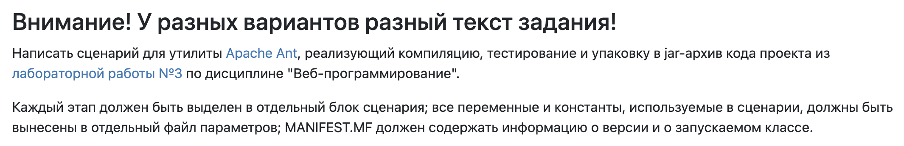
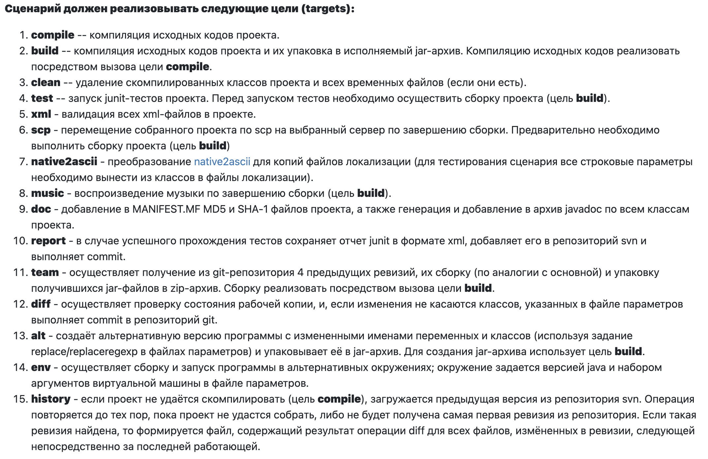
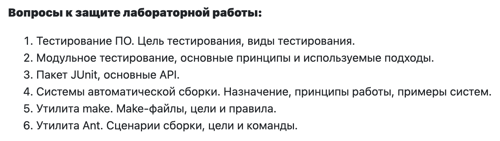

# Лапка 3

### 1. Таска:

### 2. Сценарии:

### 3. Что сделать Игорю:

| Номер | Таска              |
|-------|--------------------|
| 1     | ***compile***      |
| 2     | ***build***        |
| 3     | ***clean***        |
| 7     | ***native2ascii*** |
| 9     | ***doc***          |
| 12    | ***diff***         |
| 13    | ***alt***          |
| 15    | ***history***      |

### 4. Что сделать Максиму:

| Номер | Таска        |
|-------|--------------|
| 4     | ***test***   |
| 5     | ***xml***    |
| 6     | ***scp***    |
| 8     | ***music***  |
| 10    | ***report*** |
| 11    | ***team***   |
| 14    | ***env***    |

### 5. Вопросы для подготовки:

